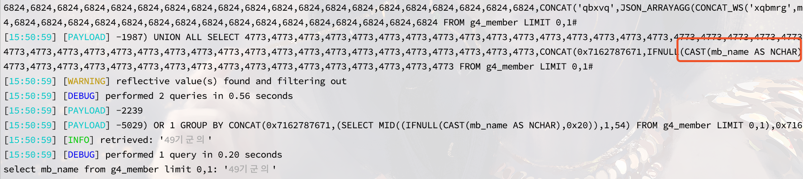
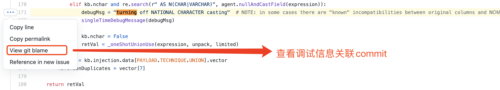
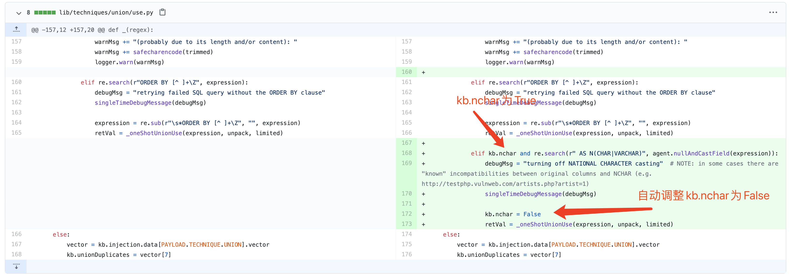

# 1. 场景

```
我们发现了一个SQL注入点，在通过sqlmap dump数据的时候出现乱码了，如果我们希望通过sqlmap选项，以合理的方式处理这些乱码的数据，就需要一些技巧性的使用方式了。
```


## 1.1 注入点

可以看到下图中，在我VPS上的sqlmap的`--sql-shell`选项下，通过sql语句来获取某个字段的内容时，sqlmap输出的数据是乱码的


# 2. 技巧

关于dump数据输出乱码，我们至少可以用二种以上的技巧来解决

- `--binary-fields`：将指定的字段以十六进制的格式输出（☆☆☆☆☆五星推荐）
- `--encoding`：数据返回时的所使用的的编码
- `不同版本的sqlmap`

## 2.1 --binary-fields

比如在上面的场景中，我们`mb_name`字段出现乱码，则我们可以通过`--binary-fields=mb_name`的方式来解决这一个问题，完整的命令如下：

```bash
sqlmap -r xxx.txt -D dbname -T tablename -C mb_id,mb_email,mb_password,mb_name --dump --binary-fields="mb_name" --sql-shell
```

我们可以再次在`sql-shell`的模式下获取mb_name内容


接下来，我们应该如何对这里的十六进制数据做处理？比如笔者上面mb_name对应的编码为`euc-kr`

```
import binascii
name = '3439B1E2B1BAC0C7'
binascii.unhexlify(name).decode("euc-kr")
```


## 2.2 --encoding

`--encoding`一般用于返回页面没有设置响应头`Content-Type`和`meta`标签的编码时使用和配置，比如在上面的场景下，`--encoding=euc-kr`

**sqlmap/lib/request/basic.py**


## 2.3 不同版本的sqlmap

为了更好的了解乱码问题的出现，我在本地电脑也进行了数据获取的操作，发现本地电脑获取mb_name数据时，并没有出现乱码的情况。

这时候我通过增加`-v 3`这一个参数来查看更多调试信息，发现了问题所在。

### 2.3.1 VPS上的输出

这里面有一条调试信息引起了我的注意`turning off NATIONAL CHARACTER casting`，我们暂且先记录下来


### 2.3.2 本地电脑的输出




### 2.3.3 问题的根源

通过对比上面两个图片的调试信息，我们可以知道出现乱码时的PAYLOAD：`CAST(mb_name AS CHAR)`，没有乱码时

`CAST(mb_name AS NCHAR)`。

为了验证是否因为CAST后的数据类型不一致，我们可以通过`--no-cast`选项来模拟乱码的场景，发现关闭CAST后，出现了我们熟悉的乱码，从而可以确定`CAST(mb_name AS NCHAR)`时才不会乱码。


### 2.3.4 问题的分析

我们在[sqlmap](https://github.com/sqlmapproject/sqlmap)的github地址来查找这个调试信息`turning off NATIONAL CHARACTER casting`。

代码如下：[传送门](https://github.com/sqlmapproject/sqlmap/blob/dd963a042d9ab7448f94400c57e25f40835f44e2/lib/techniques/union/use.py#L171)



对应的git blame地址：[git blame 传送门](https://github.com/sqlmapproject/sqlmap/blame/dd963a042d9ab7448f94400c57e25f40835f44e2/lib/techniques/union/use.py#L171)


git commit对比如下



从上面的信息我们知道，sqlmap新版本修复了一个**union注入时NCHAR**问题，在union注入的情况下，新版sqlmap会自动去掉`CAST(mb_name AS NCHAR)`的使用。

### 2.3.5 问题的解决

知道问题是不同版本的sqlmap导致的，那么咱们切换版本即可

```bash
#新版git
git switch -c c6557e2 

#旧版git
git checkout c6557e2
```


# 3. 一个搞信安的能有什么坏心思

提前了解更多关于sqlmap的技巧，可以关注"**信安日记**"这一个公众号。


