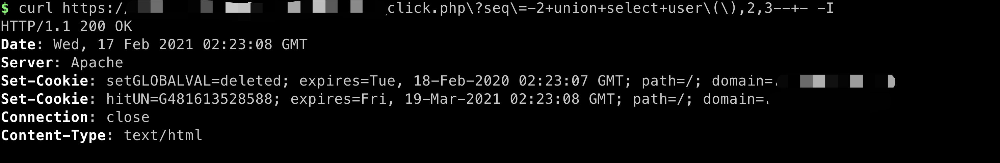

# 1. 场景

```
我们发现了一个SQL注入点，注入回显的地方是响应头的某个Header值，这时候如果我们想通过sqlmap进行漏洞利用，就需要一些技巧性的使用方式，因为sqlmap默认响应匹配是不包含响应头的。
```


## 1.1 注入点

注入成功


注入失败，可以看到注入失败时不会带上Location的响应头。



# 2. 技巧

既然要通过sqlmap进行注入点的利用，那我们就需要了解sqlmap的关于注入点检测的选项。


可以为我们所用的是`--string`选项，我们通过`--string "Location"`，即可让sqlmap检测出输出点在响应头的注入点。


## 2.1 sqlmap直接检测


可以看到，直接检测的情况下，sqlmap无法识别其它注入类型"Union"、"bool"。

## 2.2  使用技巧进行检测

```
python3 sqlmap.py --random-agent -u https://xxx/yyy_click.php\?seq=3  --string "Location:"
 --banner
```


通过`--string`或者`--regex`这一个技巧，我们就可以更好的利用输出点在响应头的SQL注入漏洞，而不是只能使用时间盲注。


# 3. 原理

如果想要了解原理或者提前了解更多关于sqlmap的技巧，可以关注"**信安日记**"这一个公众号。

